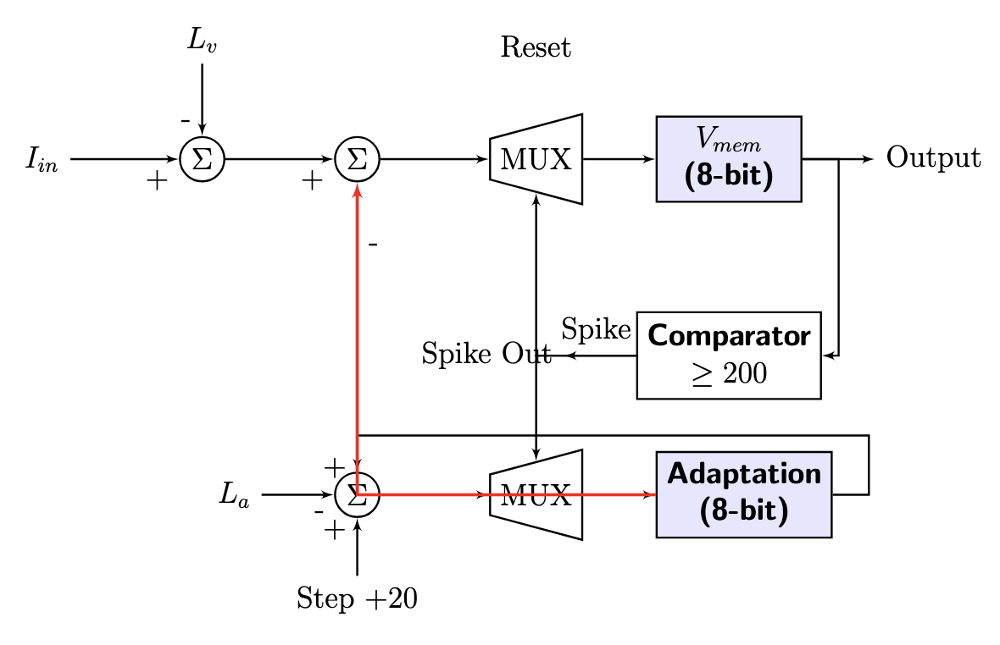
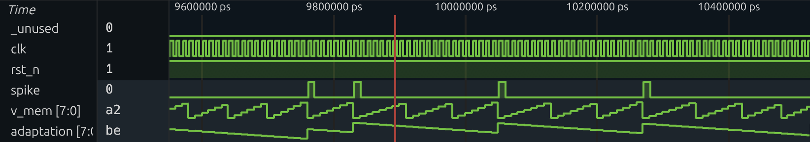
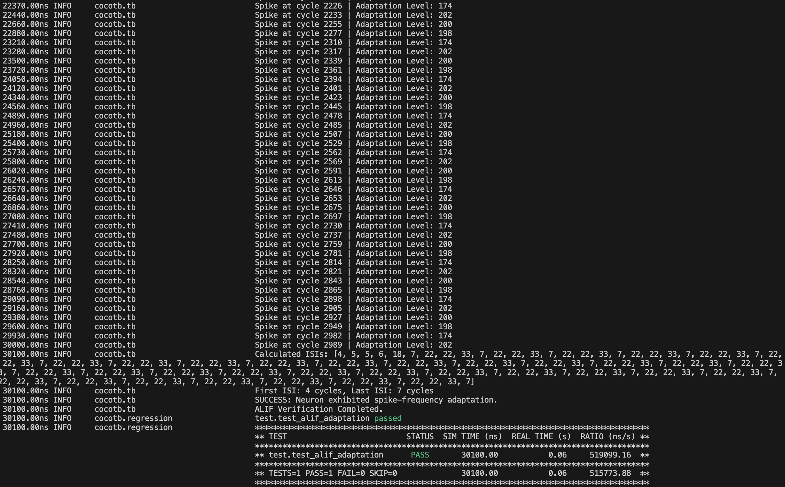

<!---

This file is used to generate your project datasheet. Please fill in the information below and delete any unused
sections.
I thi
You can also include images in this folder and reference them in the markdown. Each image must be less than
512 kb in size, and the combined size of all images must be less than 1 MB.
-->

## How it works

The design implements an Adaptive Leaky Integrate-and-Fire (ALIF) neuron, a biomimetic digital circuit optimized for the TinyTapeout 1x1 tile. Unlike a standard LIF neuron, this architecture incorporates an internal feedback mechanism to simulate Spike-Frequency Adaptation (SFA). This is a critical feature in biological neural processing that allows neurons to reduce their firing rate in response to a constant stimulus, preventing energetic saturation and enabling temporal coding.

### Architecture and Signal Integration
The system is built around a dual-register state machine consisting of an 8-bit Membrane Potential (V_mem) register and an 8-bit Adaptation (A) register. As illustrated in Figure 1, the neuron operates by integrating the input current (I_in), received via the ui_in pins, while simultaneously subtracting two "leak" components: a constant membrane leak (L_v) and a dynamic adaptation current (A). By using dedicated 8-bit registers for these states, the design ensures that temporal information is preserved across clock cycles, allowing for complex firing behaviors.

#### Figure 1: ALIF Functional Architecture



This diagram illustrates the hardware implementation of the ALIF neuron. The design processes input current (I_in) modulated by a constant membrane leak (L_v) and a dynamic adaptation signal (A) to produce the membrane potential (V_mem).

##### Main Processing Core (V_mem)
This section of the diagram simulates the neuron's cell body, where signals are integrated to build up an electrical potential.
 - V_mem (Membrane Potential Register): This 8-bit memory register stores the current electrical "charge" of the neuron. The potential changes dynamically as signals are processed and reset. An "8-bit" register means it can hold any integer value from 0 to 255.
 - I_in (Input Current): This represents the excitatory input signals the neuron is receiving. Higher I_in valuesadd more charge, causing the neuron to fire faster.
 - Summing Node (Σ): The circle with a Σ symbol acts as an adder and subtractor. It calculates the next state of the membrane potential by combining different signals.
 - Signal Arrows (Connecting Lines): Arrows indicate the direction of signal flow. The small '+' or '-' symbols next to the arrows at the summing node are critical: they dictate whether that signal is added or subtracted from the total potential. For instance, I_in has a '+' sign because it's an input adding positive charge to the neuron.

##### Leakage Mechanisms
In real neurons, the electrical charge naturally decays over time if no input is received. The ALIF model simulates this with negative feedback loops:
 - L_v(membrane Leak): This input controls a constant rate of signal decay for the membrane potential. The arrow points to the summing node with a '-' sign, indicating that a fixed amount is subtracted in each time step.
 - Adaptation (The Red Feedback Loop): This is a key feature that separates ALIF from a simpler LIF model. It simulates the biological phenomenon where a neuron becomes "fatigued" and fires less frequently in response to a continuous stimulus.
     - The 8-bit Adaptation register is connected via a red, thick line to the primary summing node with a '-' sign. This creates negative feedback: as the neuron's adaptation state builds up, it actively subtracts more charge from the main potential, making it harder and taking longer for the neuron to reach its firing threshold again.
 - L_a (Adaptation Leak): This input functions similarly to $L_v$. It controls how quickly the adaptation "fatigue" decays back to zero when there is no firing activity.

##### Spiking Logic and Reset
A neuron generates a "spike" (a brief electrical pulse) to signal other neurons once its potential crosses a specific threshold.
 - Comparator: This block acts as a logical switch. It constantly compares the value in the V_mem register to a predefined threshold. In this design, the threshold is set to >= 200.
 - Spike (Output): When V_mem hits or exceeds 200, the Comparator outputs a single "Spike" (a digital logic '1') and sends it along two main paths:
    - One path leads to the main Output of the chip.
    - The other path is a feedback signal labeled "Spike" or "Spike Out" that triggers critical reset and adaptation functions.
 - MUX (Multiplexer): This block is a digital selector.
    - Under normal conditions, it allows the new, integrated value from the summing node to pass into the V_mem register.
    - However, when it receives a "Spike" or "Reset" signal, it "switches" its input to select a different, predetermined value.
 - Reset: After generating a spike, the neuron must "reset" its potential to a baseline value. When a "Spike" is detected, the V_mem MUX selects the "Reset" input (typically a fixed value like 0) to be written into the V_mem register for the next cycle.
 - Step +20: The "Spike" signal also triggers an update in the Adaptation path. When a spike occurs, it commands the Adaptation MUX to select the value from the "Step +20" input. This fixed value is then written into the Adaptation register, increasing the neuron's "fatigue" after each firing event.

### Temporal Dynamics and Firing Logic
The membrane potential (V_mem) accumulates value until it reaches a hard-coded threshold of 200. Referring to the feedback loop shown in Figure 1, every time a spike is generated on uo_out[0], the Adaptation register (A) increments. This value is then fed back into the primary summation node to be subtracted from the next integration cycle. This specific design choice—using subtractive feedback—is what allows the neuron to exhibit "fatigue." Even with a constant input current, the increasing adaptation level slows the rate of integration, effectively lengthening the time required to reach the next threshold crossing.

### Configuration and Design Optimization
To maintain high hardware efficiency within a single TinyTapeout tile, the design utilizes fixed-point arithmetic instead of area-intensive floating-point units. The neuron's behavior is fully configurable through the uio_in pins, where the lower four bits control the membrane leak rate (L_v) and the upper four bits control the adaptation decay rate (L_a). This optimization allows the user to tune the neuron's sensitivity and recovery speed, providing a flexible platform for neuromorphic experiments while maintaining a low gate count.

## How to test

The ALIF neuron is verified using a Cocotb-based Python testbench that performs a full temporal characterization of the spike-frequency adaptation (SFA) and recovery dynamics.

### Functional Verification and Waveform Analysis
To verify the adaptation mechanism, a constant high-input current (I_in = 80) is applied. As demonstrated in the timing diagram (Figure 2), we can observe the precise sub-threshold dynamics of the 8-bit membrane potential (V_mem) and the resulting spike pulses on uo_out[0].

#### Figure 2: Waveform/Timing Diagram



This waveform shows the V_mem register and the spike output. The markers demonstrate the transition from high-frequency firing to a slower, adapted state.

### Characterization of Spike-Frequency Adaptation
By analyzing the waveform at the steady-state window, we can pinpoint the exact cycles where the negative feedback loop takes effect:
 - Initial Burst Phase: Immediately following the reset (at 0ps), the neuron fires rapidly with an Inter-Spike Interval (ISI) of only 4 clock cycles (40,000ps), as the adaptation register is still near zero.
 - Observation Window (9,600,000ps ~ 10,400,000ps): As seen in Figure 2, after the adaptation state has had time to accumulate, the "staircase" penalty is at its peak. By this timestamp, the integration slope of V_mem has become significantly shallower.

### Recovery and State Decay
The testbench further validates the "leaky" nature of the adaptation register by setting the input current to zero after the primary firing window. As verified in the simulation logs, the adaptation state (A) successfully decays back toward zero. This confirms that the neuron recovers its baseline sensitivity, ensuring the hardware is ready for subsequent stimuli without permanent "fatigue" saturation.

### Reproducing Results
 - To run the simulation and verify the metrics, execute the following commands in a Linux or Docker environment:
```bash
cd test
make
```
 - This will compile the Verilog and run the Cocotb testbench.
 - Check Terminal Output: The testbench will print the detected ISIs directly to the console. As shown in Figure 3, you should see the ISI values incrementing from 4 toward 33.

#### Figure 3: Example of Testbench Results



This console log captures the real-time calculation of Inter-Spike Intervals, confirming the transition from a 4-cycle burst to a 33-cycle adapted state.

## External hardware

This project is a self-contained digital macro designed for the TinyTapeout 1x1 tile. While no physical external components are required for simulation, the design is engineered to interface with standard CMOS-level digital systems.

### Intended Interface
In a physical deployment, the chip would be integrated as follows:
 - Digital Controller: A microcontroller or FPGA would drive the ui_in (Stimulus) and uio_in (Parameter) pins to modulate the neuron's behavior dynamically.
 - Monitoring: The uo_out pins provide a real-time digital monitor. For biological-time visualization, the 7-bit $V_{mem}$ output can be passed through an external R-2R ladder DAC to observe the sawtooth membrane dynamics on an oscilloscope.
 - Event-Based Systems: The uo_out[0] spike signal is compatible with standard Address Event Representation (AER) protocols used in larger neuromorphic arrays.
